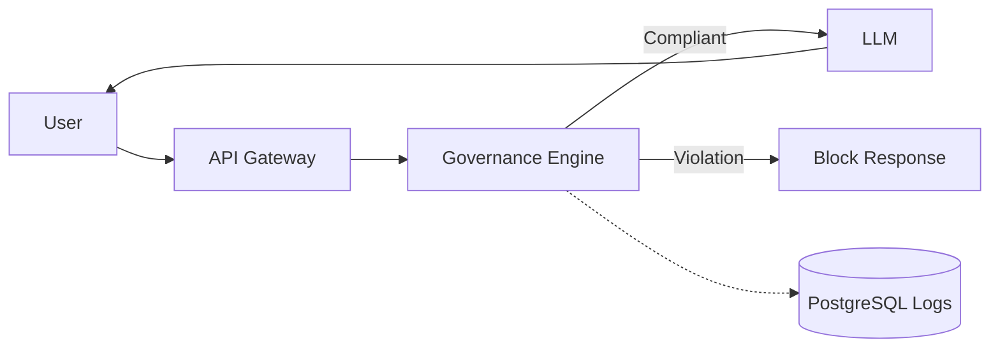

#  India AI Governance Engine (V2)
**Inference-Time AI Compliance Architecture**

> *Submitted for AI for Bharat Hackathon 2025* | *Theme: Responsible AI for India*

[](https://huggingface.co/spaces/jash-ai/AI-Governance-Engine)
[](https://huggingface.co/spaces/jash-ai/AI-Governance-Engine)
[](https://huggingface.co/spaces/jash-ai/AI-Governance-Engine)

---

## 🚀 Executive Summary

**India AI Governance Engine (V2)** is a deterministic, rule-based inference-time governance layer designed to enforce Indian regulatory compliance **before** AI responses are generated.

Unlike traditional AI pipelines that moderate output after generation, this system evaluates regulatory and safety risk before invoking any language model.

> **Core Principle:** Prevent violations, don’t clean them up later.

This architecture is **model-agnostic** and can wrap around any LLM (GPT-4, LLaMA, Mistral, etc.).

---

## 1. 🛑 Problem Statement

India’s regulatory landscape is unique and rigorous, requiring specific compliance that global models often miss:

*   **SEBI Compliance:** Strict regulations on financial advisory.
*   **Indian Medical Council:** Restrictions on automated prescriptions.
*   **DPDP Act:** Protection for Aadhaar, PAN, and other personal identifiers.
*   **Legal Advisory:** Limitations on unauthorized legal counsel.

**The Gap:** Generic AI moderation APIs are not "India-aware" and do not provide the **deterministic audit logs** required by Indian regulators. Industries need transparent decision logic, deterministic governance, and audit-ready traceability.

---

## 2. 🛡️ System Philosophy

### 2.1 Governance Before Generation
We inverted the traditional pipeline to ensure safety first.

**Traditional System:**
`User → LLM → Response → Moderation (maybe)`

**V2 System:**
`User → Governance Engine → Decision → LLM (if approved)`

*If blocked, the LLM is never called, saving cost and preventing risk.*

### 2.2 Deterministic Over Probabilistic
For regulatory systems, **predictability > creativity** and **explainability > raw capability**.

V2 uses rule-based and pattern-based detection to ensure:
1.  **Same Input → Same Output** (Consistency)
2.  **Clear Traceability** for audits
3.  **Immediate Rule Updates** without retraining models

---

## 3. ⚙️ Core Architecture

### Layered Governance Pipeline


---

## 4. 🧩 Module Design

### 4.1 PII Detection & Redaction
**Purpose:** Enforce **DPDP Act** compliance.

*   **Detects:**
    *   Aadhaar (12-digit structured)
    *   PAN format (`ABCDE1234F`)
    *   Indian mobile numbers (`+91`)
    *   Email addresses & Credit card patterns
*   **Design Choice:** Regex-based detection for **deterministic** results and **<10ms latency**.
*   **Action:** Redaction happens *before* any further processing.

### 4.2 Intent Classification
Classifies user queries into specific regulatory domains:

| Category | Example | Note |
| :--- | :--- | :--- |
| **SAFE** | "Explain quantum physics" | General knowledge |
| **FINANCIAL** | "Should I buy Reliance shares?" | SEBI trigger |
| **MEDICAL** | "Prescribe antibiotics" | Medical Council trigger |
| **LEGAL** | "How to draft a divorce deed?" | Bar Council trigger |
| **SELF_HARM** | "I want to end it all" | Critical safety |
| **VIOLENCE** | "How to make a bomb" | Illegal/Violent |
| **ILLEGAL** | "How to evade taxes" | Illegal activity |
| **PII** | "My Aadhaar is..." | Privacy violation |

**Approach:** Keyword + structural pattern detection with dual scoring (action + domain term). Includes normalization to handle adversarial text.

### 4.3 Attack Vector Detection
**Purpose:** Increase risk score for suspicious intent.
*   **Detects:** Prompt injection, Obfuscation (leetspeak), Urgency manipulation, Rule bypass attempts.
*   **Performance:** Baseline detection on known prompt-injection patterns. Expanded adversarial evaluation planned in V3.

### 4.4 Risk Scoring Engine
Calculates a **Risk Score (0.0 – 1.0)** based on:
1.  Intent Category
2.  Attack Signals
3.  PII Detection
4.  Context

Used to determine the final action: **BLOCK**, **ABSTAIN**, or **ALLOW**.

### 4.5 Policy Enforcement
Applies specific Indian regulations (SEBI, Medical Council, DPDP, Bar Council).

**Output Structure:**
```json
{
  "decision": "BLOCK",
  "category": "FINANCIAL",
  "regulation": "SEBI",
  "risk_score": 0.78
}
```

---

## 5. 📊 Evaluation Framework

V2 includes a governance evaluation suite measuring **accuracy of governance**, not generation quality.

### Current Metrics (69-query evaluation set)
*   **Precision:** 0.91
*   **Recall:** 0.91 (High violation detection rate)

**Category Breakdown:**
*   **Financial Recall:** 0.91
*   **Medical Recall:** 0.90
*   **PII Recall:** 0.33 (Format expansion planned)

---

## 6. ⚡ Performance Characteristics

Designed for real-time integration with production systems.

**Governance Latency (Measured):**
*   **Total Synchronous Overhead:** **~45ms**

**Module Breakdown:**
*   PII Detection: **10ms**
*   Intent Detection: **15ms**
*   Attack Detection: **8ms**
*   Risk Scoring: **5ms**
*   Policy Enforcement: **7ms**

---

## 7. ☁️ Deployment Model

V2 is containerized (**Docker**) and deployable via **AWS ECS**.

*   **Architecture:**
    *   Load-balanced API
    *   **PostgreSQL** for audit logging
    *   **Redis** for caching
    *   Horizontal scaling enabled

**Deployment Flow:**


*   **Model-Agnostic:** Can wrap GPT-4, Claude, Gemini, LLaMA, Mistral, or any future LLM.

---

## 8. 🔒 Security & Compliance

*   **Encryption:** TLS in transit, AES-256 at rest.
*   **Privacy:** PII redacted **before** logging.
*   **Audit:** Logs retained for compliance (SEBI/Medical).
*   **Traceability:** Deterministic decision trace for every request.
*   **Integrity:** No LLM weight modification required.

---

## 9. ⚠️ Current Limitations (Honest Disclosure)

Transparency builds credibility.

1.  **Rule-based Intent Detection:** ~87% accuracy. Can miss nuanced queries.
2.  **PII Detection:** Format coverage is still expanding (currently low recall on edge cases).
3.  **Attack Detection:** Not comprehensive against novel jailbreaks.
4.  **No Semantic Clustering:** Future work planned.

---

## 10. 🔮 V3 Roadmap – Alignment-First Governance Architecture

**Vision Shift:** V2 focuses on *deterministic rule-based* enforcement. **V3** transitions toward *principled, reasoning-based* governance that evaluates intent, uncertainty, and stability.

This is not a classifier upgrade. **This is an architectural evolution.**

### V3 Core Architecture Goals

#### 1️⃣ Governance Agent (Pre-LLM Orchestrator)
Instead of directly applying policy rules, a Governance Agent will:
*   Decompose intent & extract atomic claims.
*   Identify knowledge dependencies.
*   Evaluate policy principles & estimate uncertainty.
*   Run stability checks.
*   *The LLM becomes an untrusted tool, not a decision-maker.*

#### 2️⃣ Claim Decomposition Layer (Hallucination Prevention)
*   Break prompt into atomic claims.
*   Identify unverifiable or time-sensitive claims.
*   **Goal:** Prevent hallucinations before they occur. Abstan if claims cannot be supported.

#### 3️⃣ Constitutional Judgment Engine
Replace static rules with a "Judge Model" evaluating: *"Does this request violate governance principles?"*
*   **Principles:** Human safety, Non-deception, Epistemic humility, Regulatory compliance.
*   **Output:** Decision, Reasoning trace, Confidence score.

#### 4️⃣ Uncertainty Estimation Layer
*   Move from rule certainty → **calibrated uncertainty**.
*   Claim-level confident scoring & risk aggregation.
*   **Goal:** Refusal becomes principled, not defensive.

#### 5️⃣ Stability & Robustness Check
*   Re-evaluate with paraphrased prompts.
*   Detect decision flips.
*   **Action:** Downgrade unstable outputs to ABSTAIN.

#### 6️⃣ Safe Exit Strategy Engine
*   Provide educational fallbacks or regulatory explanations instead of a hard BLOCK.
*   Ensure **Entry Logic = Exit Logic Maturity**.

#### 7️⃣ Human-in-the-Loop Memory (No Retraining)
*   Store governance failures and corrected decisions.
*   Retrieve similar past cases for in-context learning.
*   **Transparent improvement** without hidden weight updates.

#### 8️⃣ Model-Agnostic LLM Integration
*   Integrate with GPT-style APIs, Open-source models (LLaMA, Mistral), and SLMs.
*   Governance remains independent of model internals.

### V3 Workflow Example
**User Query:** "Should I invest in XYZ stock?"
1.  **Decompose:** "Investing in XYZ will yield returns."
2.  **Evaluate Principle:** "Is this personalized financial advice?" (SEBI Regulation)
3.  **Estimate Uncertainty:** High confidence of violation.
4.  **Decision:** **ABSTAIN** with regulatory explanation.

---

## 11. 💡 What Makes This Different

*   **India-First Regulatory Logic:** Specifically built for SEBI, Medical Council, and DPDP Act.
*   **Deterministic Inference-Time Governance:** Predictable and audit-ready.
*   **Model-Agnostic Wrapper:** Works with any model.
*   **Pre-Generation Compliance:** Enforces rules *before* cost is incurred.
*   **Governance Infrastructure:** This is not a chatbot; it's a safety layer.

---

## 12. 🏁 Conclusion

**India AI Governance Engine (V2)** demonstrates that:
1.  Regulatory AI safety can be **deterministic**.
2.  Governance can run in **<50ms**.
3.  Compliance can be enforced **before generation**.
4.  Model-agnostic safety layers are **feasible** and **scalable**.

V2 is a functional, deployable governance layer ready for integration today.

---

## 13. 📥 Deployment & Access

### Live Demonstration
*   **HuggingFace Space:** [AI Governance Engine Demo](https://huggingface.co/spaces/jash-ai/AI-Governance-Engine)

### Source Code Repository
*   **GitHub:** [India AI Governance Repo](https://github.com/your-username/india-ai-governance)

### Deployment Environment
*   **Container:** Dockerized FastAPI microservice
*   **Hosting:** AWS ECS
*   **Database:** PostgreSQL (Audit Logs), Redis (Caching)
*   **Scalability:** Horizontal scaling enabled (Scales to 400+ req/sec)

### Measured Governance Overhead
*   **~45ms** average inference-time latency
*   **p95 latency < 100ms** under load

---

### Author
**A. Jaswanth**
*AI Governance & Safety*


