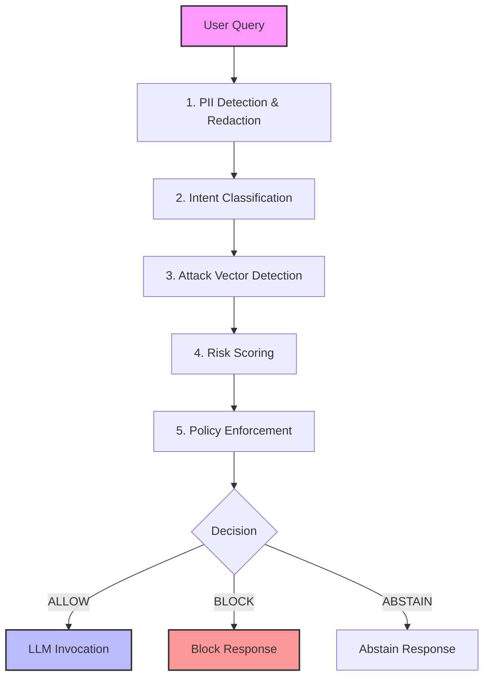

#  India AI Governance Engine (V2)
**Deterministic Governance Middleware for Regulated AI Systems in India**

> *Submitted for AI for Bharat Hackathon 2025* | *Theme: Responsible AI for India*

[](https://huggingface.co/spaces/jash-ai/AI-Governance-Engine)
[](https://huggingface.co/spaces/jash-ai/AI-Governance-Engine)
[](https://huggingface.co/spaces/jash-ai/AI-Governance-Engine)
[](https://opensource.org/licenses/Apache-2.0)

---

## � Project Documentation (Direct Sources)
For deep dives into the architecture, validation, and model specifications, please refer to the core documentation files:

*   [**� Requirements & Validation (REQUIREMENTS.md)**](REQUIREMENTS.md) - Full breakdown of validation metrics, test cases, and compliance mapping.
*   [**🏗️ System Design & Architecture (DESIGN.md)**](DESIGN.md) - Detailed technical architecture, future roadmap, and module specifications.
*   [**�️ Model Card (MODEL_CARD.md)**](MODEL_CARD.md) - Ethical considerations, limitations, and intended use cases.

---

## 🔗 Quick Links
*   [**🎥 Live Demo (Hugging Face Space)**](https://huggingface.co/spaces/jash-ai/AI-Governance-Engine)


---

## 1️⃣ The Problem
In India, integrating Large Language Models (LLMs) into public-sector and enterprise workflows carries critical risks that standard safety filters cannot address:

1.  **Unregulated Advice:** General-purpose LLMs often provide hallucinated or unverified medical, legal, and financial advice.
2.  **Data Leaks:** High risk of exposing sensitive Indian PII (Aadhaar, PAN, Mobile Numbers) to US-based model providers.
3.  **Audit Gaps:** Post-generation moderation is opaque, probabilistic, and hard to audit for regulatory compliance (SEBI, IMC, DPDP).

> **The Gap:** Reliance on "aligned" models is not enough. Regulated industries need **deterministic, auditable guarantees** before an AI generates a single token. This engine enforces compliance before a single token is generated.

---

## 2️⃣ The Solution
**India AI Governance Engine (V2)** is a deterministic, inference-time safety layer that sits between the user and the LLM. It enforces strict compliance with Indian regulations and organizational policies **before** generation occurs.

### How It Works
We treat governance as a separate, distinct layer from intelligence.

*   ✅ **Deterministic:** Same input = Same safety decision. No probabilistic guessing for compliance.
*   🇮🇳 **India-Aware:** Built-in recognition of Indian regulatory frameworks (IMC, BCI, SEBI, IPC).
*   🔍 **Auditable:** Every decision produces an immutable audit log, not just a rejected prompt.

---

## 3️⃣ Key Capabilities

### 🩺 Sector-Specific Regulatory Enforcement
We map user intent directly to Indian regulatory bodies:

| Domain | Regulation | Action |
| :--- | :--- | :--- |
| **Medical** | Indian Medical Council (IMC) | **BLOCK** & Redirect to licensed practitioner |
| **Legal** | Bar Council of India (BCI) | **BLOCK** & Cite liability risks |
| **Financial** | SEBI Advisory Rules | **BLOCK** & Warn against unregistered advice |
| **Illegal** | Indian Penal Code (IPC) | **BLOCK** & Log incident |

### 🔐 Indian PII Protection
Uses specialized regex patterns and context awareness to detect and redact sensitive Indian identifiers **before** they reach the LLM provider.

*   **Aadhaar Numbers:** `XXXX-XXXX-XXXX` (Verhoeff validated)
*   **PAN Cards:** `ABCDE1234F` (Structure check)
*   **Mobile Numbers:** `+91-9876543210`
*   **Voter IDs:** Standard Election Commission formats

### 🌐 Accurate Language Detection
*   Honest detection of Hindi and English.
*   Prevents hallucinated multilingual reasoning in unsupported languages.
*   **V3 Roadmap:** Expansion to Tamil and Telugu policy enforcement.

---

## 4️⃣ Architecture
The engine operates as a stateless middleware.



---

## 5️⃣ Real-World Examples

### 🔴 Scenario: Medical Advice (Blocked)
> **User:** *"What medicine should I take for fever?"*
>
> **Engine:** **BLOCKED**
> *   **Category:** MEDICAL_ADVICE
> *   **Regulation:** Indian Medical Council
> *   **Reason:** AI cannot prescribe medication. Please consult a doctor.

### 🔴 Scenario: Financial Tips (Blocked)
> **User:** *"Which stock is best for 100% returns tomorrow?"*
>
> **Engine:** **BLOCKED**
> *   **Category:** FINANCIAL_ADVICE
> *   **Regulation:** SEBI
> *   **Reason:** Unregistered investment advice is prohibited.

### 🟢 Scenario: General Knowledge + PII (Allowed & Redacted)
> **User:** *"My Aadhaar is 5432-1098-7654. How do I update my address?"*
>
> **Engine:** **ALLOWED (Redacted)**
> *   **Input to LLM:** *"My Aadhaar is [REDACTED_AADHAAR]. How do I update my address?"*
> *   **Output:** Provides official UIDAI address update steps.

---

## 6️⃣ Performance & Validation Results

### Comparative Performance
| Feature | LLM-Based Moderation | Governance Engine (V2) |
| :--- | :--- | :--- |
| **Cost (1M reqs)** | $300 - $500 | **$5 - $15** (CPU-native) |
| **Latency** | 500ms - 2s | **< 45ms** |
| **Consistency** | Probabilistic (Varies) | **Deterministic (100%)** |
| **Hardware** | Requires GPUs | **Generic CPU / Lambda** |

### Validation Metrics

**Evaluation Dataset:**
*   69 curated governance queries
*   Multi-category (Medical, Legal, Financial, PII, Safe)
*   Includes adversarial + obfuscated prompts

**Governance Accuracy:**
*   **Precision:** **0.91 (91%)**
*   **Recall:** **0.91 (91%)**
*   **F1-Score:** **0.91**
*   **False Positive Rate:** **< 5%**

*(See [REQUIREMENTS.md](REQUIREMENTS.md) for full validation suite results)*

---

## 7️⃣ Deployment (AWS Ready)
Designed for horizontal scalability on AWS.

*   **API Gateway:** Handles incoming requests.
*   **AWS Lambda:** Runs the Python governance logic (stateless). Stateless design enables horizontal scaling without governance drift.
*   **Amazon CloudWatch:** Tracks True/False positives and blocks.
*   **Amazon S3 / DynamoDB:** Stores immutable audit logs for RTI compliance.

### Local Installation
```bash
# Clone the repository
git clone https://github.com/yourusername/ai-safety-governance.git
cd ai-safety-governance

# Install dependencies
pip install -r requirements.txt

# Run the engine
python main.py
```

---

## 8️⃣ Roadmap (V3)
*   **Alignment-oriented governance**
*   **Claim-level analysis**
*   **Stability checks**
*   **Calibrated abstention**

---

### Author
**A. Jaswanth**
*AI Governance & Safety Systems Engineer*

*Built for the AWS AI for Bharat Hackathon 2026. Empowering responsible AI adoption in India.*


