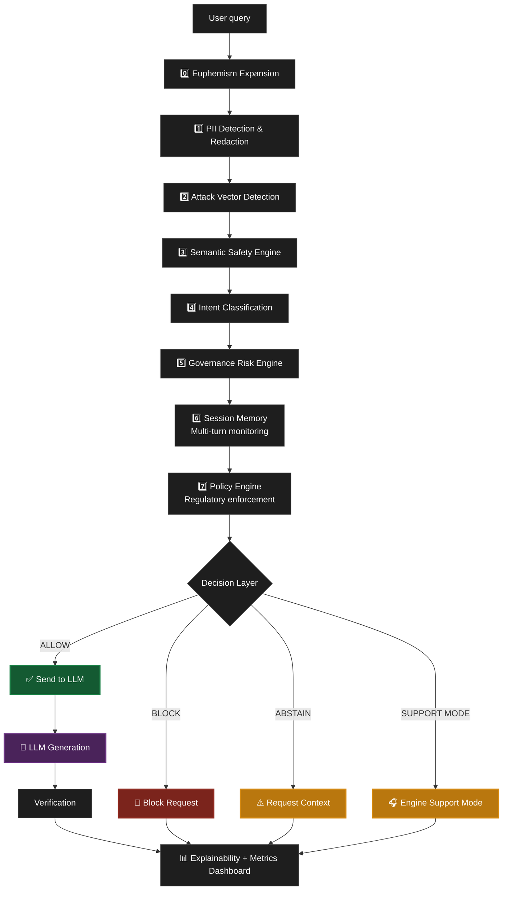
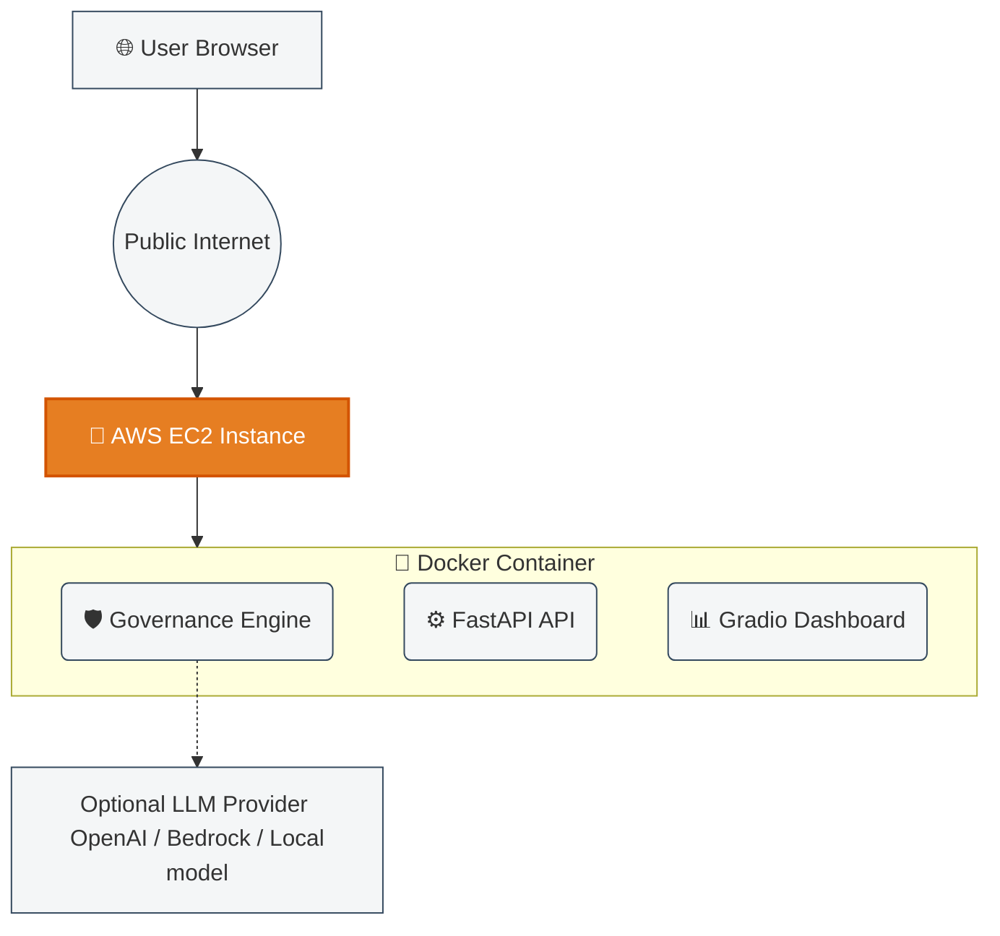
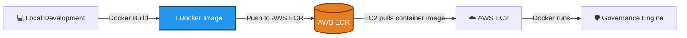

#  India AI Governance Engine (V2) — Requirements

This document outlines the system requirements, software dependencies, infrastructure setup, and evaluation prerequisites required to build, deploy, and run the **India AI Governance Engine**.

The governance engine operates as a deterministic inference-time safety layer that enforces regulatory policies **before** an LLM generates responses.

---

## 1. 🧠 System Overview

The system implements a multi-stage governance pipeline that evaluates user queries for regulatory compliance, safety risks, and privacy violations. Unsafe prompts are blocked or redirected before reaching the LLM.

### ⚙️ Governance Pipeline Architecture


```mermaid
graph TD
    classDef default fill:#1E1E1E,stroke:#444,stroke-width:1px,color:#fff;
    classDef user fill:#2C3E50,stroke:#34495E,stroke-width:2px,color:#fff;
    classDef LLM fill:#4A235A,stroke:#6C3483,stroke-width:2px,color:#fff;
    classDef allow fill:#145A32,stroke:#1E8449,stroke-width:2px,color:#fff;
    classDef block fill:#7B241C,stroke:#922B21,stroke-width:2px,color:#fff;
    classDef abstain fill:#B9770E,stroke:#D68910,stroke-width:2px,color:#fff;
    
        direction TB
        P0[0️⃣ Euphemism Expansion]
        P1[1️⃣ PII Detection & Redaction]
        P2[2️⃣ Attack Vector Detection]
        P2a[3️⃣ Semantic Safety Engine]
        P3[4️⃣ Intent Classification]
        P4[5️⃣ Governance Risk Engine]
        P5[6️⃣ Session Memory <br/> Multi-turn monitoring]
        P6[7️⃣ Policy Engine <br/> Regulatory enforcement]
        
        UserQuery[User query] --> P0
        P0 --> P1 --> P2 --> P2a --> P3 --> P4 --> P5 --> P6
    
    P6 --> DL{Decision Layer}
    
    DL -->|ALLOW| AL[✅ Send to LLM]:::allow
    DL -->|BLOCK| BL[🛑 Block Request]:::block
    DL -->|ABSTAIN| AB[⚠️ Request Context]:::abstain
    DL -->|SUPPORT MODE| SM[🎧 Engine Support Mode]:::abstain
    
    AL --> LLM[🧠 LLM Generation]:::LLM
    LLM --> VL[Verification]
    
    VL --> EE[📊 Explainability + Metrics Dashboard]
    BL --> EE
    AB --> EE
    SM --> EE
```

---

## 2. 💻 Hardware Requirements

The governance engine is optimized to run on CPU-only infrastructure, eliminating the need for expensive GPU acceleration.

| Component | Minimum Requirement | Recommended |
| :--- | :--- | :--- |
| **CPU** | 2 vCPU | 4 vCPU |
| **RAM** | 4 GB | 8 GB |
| **Storage** | 10 GB | 20 GB |
| **GPU** | Not required | Optional |

---

## 3. 🖥️ Operating System

Supported environments for development and deployment. Production deployment is highly recommended on Linux servers.

| OS | Version | Notes |
| :--- | :--- | :--- |
| **Ubuntu** | 20.04+ | Recommended for Production |
| **Amazon Linux** | 2 | Supported in AWS |
| **macOS** | 12+ | Development only |
| **Windows** | 10/11 | WSL (Windows Subsystem for Linux) recommended |

---

## 4. 🛠️ Software Requirements

Required system tools and dependencies.

| Software | Minimum Version |
| :--- | :--- |
| **Python** | 3.9+ |
| **Docker** | 20+ |
| **Git** | Latest |
| **AWS CLI** | v2 |

---

## 5. 📦 Python Dependencies

Core Python libraries required to run the governance engine.

**Example `requirements.txt`:**
```text
fastapi
uvicorn
gradio
transformers
torch
numpy
pandas
scikit-learn
regex
python-dotenv
```

**Optional libraries:**
```text
sentence-transformers
datasets
```

---

## 6. 🤖 Model Requirements

The governance engine uses a lightweight transformer model for intent classification, ensuring fast, CPU-bound inference.

- **Example Model:** `facebook/bart-large-mnli`
- **Model Size:** ~1.6 GB

*Ensure sufficient disk space for model caching.*

---

## 7. ☁️ Cloud Infrastructure Requirements

Recommended cloud deployment architecture for scalable and secure hosting.

| Service | Role |
| :--- | :--- |
| **AWS EC2** | Host governance engine |
| **AWS ECR** | Store Docker images |
| **Docker** | Container runtime engine |
| **Public IPv4** | Access governance dashboard |

- **Recommended EC2 Instance Type:** `t3.medium`
- **Recommended AWS Region:** `ap-south-1` (Mumbai) or `us-east-1`

---

## 8. 🏗️ AWS Deployment Architecture


```mermaid
graph TD
    classDef default fill:#f4f6f7,stroke:#34495e,stroke-width:1px;
    classDef aws fill:#e67e22,stroke:#d35400,stroke-width:2px,color:#fff;
    classDef docker fill:#2496ed,stroke:#154360,stroke-width:2px,color:#fff;
    
    UB[🌐 User Browser] --> PI((Public Internet))
    PI --> EC2[🚀 AWS EC2 Instance]:::aws
    
    subgraph Container_Environment [🐳 Docker Container]
        direction TB
        GE(🛡️ Governance Engine)
        FB(⚙️ FastAPI API)
        UI(📊 Gradio Dashboard)
    end
    
    EC2 --> Container_Environment
    
    GE -.-> LLM[Optional LLM Provider <br/> OpenAI / Bedrock / Local model]
```

---

## 9. 🐳 Container Deployment Workflow

The system is deployed using Docker for reproducible and isolated environments.

**1. Build Container:**
```bash
docker build -t ai-governance .
```

**2. Run Container:**
```bash
docker run -d -p 7860:7860 ai-governance
```

**3. Access Dashboard:**
```text
http://EC2_PUBLIC_IP:7860
```

---

## 10. 📦 AWS Container Registry (ECR) Workflow

Docker images are stored in AWS Elastic Container Registry to facilitate easy EC2 deployment.


```mermaid
graph LR
    classDef ecr fill:#e67e22,stroke:#873600,stroke-width:2px,color:#fff;
    classDef docker fill:#2496ed,stroke:#154360,stroke-width:2px,color:#fff;
    
    Dev[💻 Local Development] -->|Docker Build| DI[🐋 Docker Image]:::docker
    DI -->|Push to AWS ECR| ECR[(AWS ECR)]:::ecr
    ECR -->|EC2 pulls container image| EC2[☁️ AWS EC2]
    EC2 -->|Docker runs| GE[🛡️ Governance Engine]
```

---

## 11. 🌐 Network Requirements

Ensure the EC2 Security Group allows inbound traffic on the following required ports:

| Port | Purpose |
| :--- | :--- |
| **7860** | Governance Dashboard (Gradio) |
| **8000** | FastAPI API (Optional) |

---

## 12. 📋 Governance Evaluation Dataset

Evaluation is performed using a curated dataset designed to test the engine's boundaries.

- **Dataset size:** 69 governance test prompts
- **Testing Categories Include:**
  - Medical advice
  - Financial advice
  - Legal advice
  - Violence
  - Self-harm
  - Safe (Benign) queries

---

## 13. 📊 Governance Performance Metrics

Evaluation results based on the curated dataset:

| Metric | Score | Detail |
| :--- | :--- | :--- |
| **Precision** | 0.98 | Low false positive rate |
| **Recall** | 0.76 | High violation detection |
| **True Positives** | 44 | Correctly identified violations |
| **True Negatives** | 61 | Correctly identified safe prompts |
| **False Positives** | 1 | Safe prompts blocked incorrectly |
| **False Negatives** | 14 | Violations missed |

---

## 14. 📈 Real-Time Governance Metrics

The system dashboard provides live metrics enabling runtime governance monitoring.

**Example Dashboard Output:**
```text
Total Requests: 2
Allowed: 0
Blocked: 2
Abstained: 0
Support Mode: 0
Escalations: 0
```

---

## 15. 🔒 Security & Compliance

The system enforces policies aligned with strict Indian regulatory frameworks.

| Regulation | Enforcement Coverage |
| :--- | :--- |
| **SEBI** | Financial advice restrictions & unauthorized recommendations |
| **IMC** | Medical advice governance & prescription blocking |
| **BCI** | Legal advice restrictions |
| **IPC** | Illegal activity detection |
| **DPDP Act** | Personal data protection & PII redaction |

---

## 16. 🛠️ Environment Setup

For local development without Docker:

**1. Create a Python environment:**
```bash
python -m venv venv
source venv/bin/activate  # On Windows: venv\Scripts\activate
```

**2. Install dependencies:**
```bash
pip install -r requirements.txt
```

---

## 17. 📂 Repository Structure

Recommended repository layout for the Governance Engine:

```text
ai-governance-engine
│
├── README.md
├── REQUIREMENTS.md
├── requirements.txt
├── Dockerfile
│
├── app
│   ├── app.py
│   ├── pipeline
│   ├── policies
│   ├── classifiers
│
├── evaluation
│   ├── dataset
│   └── metrics
│
└── deployment
    └── aws
```

---

## 18. 🚀 Scalability & Performance

The governance engine is designed for efficient, low-cost scaling.
- Stateless processing architectures
- Horizontal scaling capability
- CPU-based inference

**Typical Latency Profiling:**
- **p50 Latency:** ≈ 38ms
- **p95 Latency:** ≈ 85ms

---

## 19. 🧭 System Design Principles

The system strictly follows these key governance principles:

1. **Deterministic Decisions:** Same input → same governance result every time.
2. **Pre-generation Enforcement:** Unsafe prompts are blocked *before* they ever reach the LLM.
3. **Explainable Governance:** Every decision produces a traceable, auditable reasoning timeline.

---

## 20. ⚠️ Scope, Limitations & Mitigation

To ensure this system is production-ready today, specific design choices were made that come with trade-offs.

### ⚠️ Current Limitations (V2)

- **Prompt-Level Evaluation:** Prompts are evaluated as a single unit rather than decomposed into structured claims.
- **Static Policy Mapping:** Governance rules are currently implemented as deterministic mappings rather than dynamically retrieved regulatory knowledge.
- **Decision Stability:** Slight variations in prompt wording may produce different governance outcomes.
- **Limited Post-Generation Verification:** The system focuses primarily on pre-generation governance with limited validation of generated responses.
- **Minimal Human Oversight:** Low-confidence decisions are handled automatically without structured human review.
- **Limited Automated Learning from Telemetry:** Governance history and decision traces are logged, but they are not yet used to automatically refine policies or detection models.

---

## 21. 🔮 Future Extensions (V3 Roadmap)

V2 implements deterministic, rule-based and semantic regulatory enforcement at inference time. V3 evolves the governance layer toward alignment-oriented decision evaluation.

### 🚀 Planned Improvements (V3)

- **Intent & Claim Decomposition:** Structured prompt decomposition for fine-grained governance evaluation.
- **Constitutional Retrieval Layer:** Dynamic retrieval of regulatory knowledge and legal precedents using a vector database.
- **Stability Verification Engine:** Evaluate governance decisions across paraphrased prompts to ensure consistency.
- **Post-Generation Verification:** Generated responses will be verified before being streamed to users.
- **Human-in-the-Loop Governance:** Ambiguous or low-confidence cases will be routed to a human review queue.
- **Adaptive Governance Learning:** Governance history and telemetry data will be used to automatically improve policy rules, semantic detection, and risk scoring.
- **Multilingual Governance Policies:** Support for Tamil, Telugu, Bengali, and Marathi.
- **Distributed Governance Architecture:** Scale processing across multiple regional nodes.
